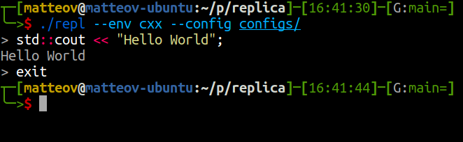

# replica

A configurable repl (read-eval-print-loop) capable of running multiple compiled languages (C, C++, D and more to come)

## How to use ?

## A problem, an idea ?

Open an issue and we can discuss it :)
